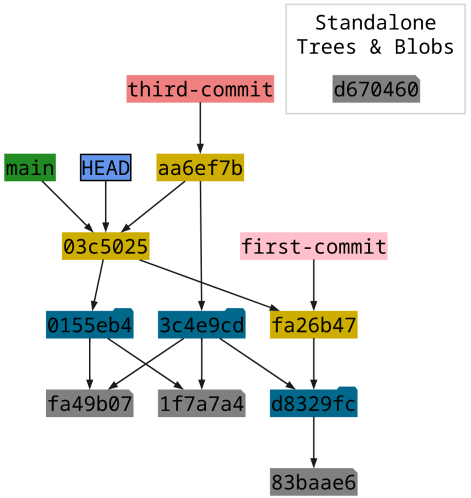

{ width=400px align=left }

!!! note ""

	+ **Upcoming Course Dates**: 29 April &mdash; 6 May, 2026
	+ **Course Format**: this is a "_Project Studio_" style course &mdash; see [description](#course-format)
	+ **Cost**: €140
	+ **Register**: contact us at contact@manabiya.fr
    + **Instructor**: [Dimitar Dimitrov{ align=right width="180" }](https://drdv.net)
	+ **Language**: English

# Git for non-coders (Organize, Track changes, Collaborate Better)

This is an in-person, hands-on introduction to [Git](https://git-scm.com/) designed for
people who are _not_ software developers. Git is a powerful tool that has transformed the
way people manage projects and collaborate. It can help you organize your work and
planning, maintain a history of your progress, and manage common projects with others.

## Target audience

People of all ages are welcome (16 and above). Git is especially useful for high-school
and University students that have to manage many classes and assignments simultaneously,
as well as to collaborate with their peers. If you work in industry and are struggling
to stay afloat with your documentation and planning, consider taking this course.
Contrary to common beliefs, Git is not something only programmers use &mdash; it can be
useful for everybody!

There is one prerequisite: we assume that you have your own computer that you can bring
and work with.

## Project description

You will build a website[^1] collaboratively with others on
[GitHub](https://github.com/). This involves exchanging ideas, planning tasks and
documenting progress. The project is designed to cover a variety of use cases, as our
**main goal** is for you actually discover ways to leverage Git (and platforms like
GitHub) in your own work afterwards.

## Course format

We will have the following in-person live sessions (in the [office](../contact.md) of
Manabiya)[^attendance]:

+ **Wednesday** 29-th April: 14:00 &mdash; 18:00
+ **Saturdays** 2-th May: 09:30 &mdash; 17:30 (with an hour and a half of lunch break)
+ **Monday** 4-th May: 18:00 &mdash; 20:00
+ **Wednesday** 6-th may: 14:00 &mdash; 18:00

There would be a considerable exchange on GitHub (using the "Issues" interface) as well
as on-demand online discussions (e.g., over Google Meet) to address pressing questions.

In total, over 15 hours of in-person workshops and a week-long follow-up online. This
would establish a good base to build on. So, **treat yourself a week of Git**!

[^1]: We will not use directly languages for web development (like HTML, CSS,
    JavaScript) so it is not a problem if you are not familiar with them. 

[^attendance]: It is possible to make changes to the time slots (whenever necessary).
