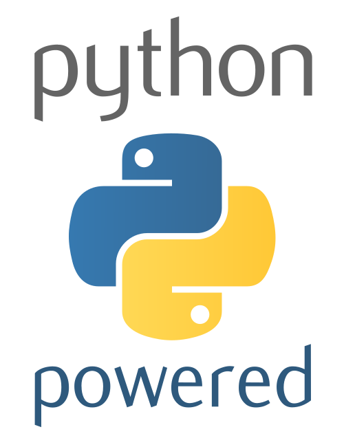

{ width=310px align=left }

!!! note ""

	+ **Most recent offering**: Started on 9 May, 2026 (Four-Saturday Series)
	+ **Course Format**: Four-Saturday Series &mdash; see [description](#course-format)
	+ **Cost**: €290
	+ **Interested?**: contact us at contact@manabiya.fr
    + **Instructor**: [Dimitar Dimitrov{ align=right width="180" }](https://drdv.net)
	+ **Language**: English

# Python for Beginners

## Overview

This is a beginner Python course built around in-person communication on-site. The focus
is on how to use Python to explore, understand, model and solve practical problems. The
aim is to become aware of what Python can actually do **for** you, whether you want to
automate an everyday task or understand a math problem at school. If you come with a
concrete problem in mind, we can discuss it and create a plan for approaching its
solution (you will receive follow-up guidance throughout the course, beyond the
scheduled sessions).

## Target audience

People of all ages are welcome (16 and above). We do not assume prior experience with
python or math. It would help if you have used some other programming language before
(even if you don't remember the details), but this is not a prerequisite. However, we
assume that you have your own computer that you can bring and work with[^prerequisites]
&mdash; learning to program is not a spectator sport, you have to jump in and get your
hands dirty.

## What will I learn?

You will learn:

+ [X] To use [GitHub](https://github.com/) to collaborate on a project, as well as
      basics of [Git](https://git-scm.com/).
+ [X] To formulate and solve problems using [Python](https://www.python.org/):
    + basic syntax, expressions, and statements
	+ how and when to use: lists, dictionaries, sets, tuples, ...
	+ string processing
	+ control flow: loops, conditionals
    + functions, error handling, working with files
	+ object-oriented programming.
+ [X] To use the python ecosystem.
+ [X] To visualize data in a [Jupyter notebook](https://jupyter.org/) using
      [Matplotlib](https://matplotlib.org/).

In the end, you will have a solid base to build on.

## Course format

This is an in-person, on-site course. We will have live coding sessions from 09:30 to
17:30 (with an hour and a half of lunch break) four Saturdays in a row starting on 9
May. Whenever needed, we can organize dedicated discussion sessions via e.g., Google
Meet for follow-up and to address pressing questions.

This is 30 hours of live-coding on-site and month-long follow-up. This will help you
jump-start you next project.

[^prerequisites]: You could use Windows, macOS, or Linux (the latter two are
preferable). Before the course starts, you will receive a few suggestions for things to
review in advance (although this is not strictly required, it will help you benefit
fully from the course).

