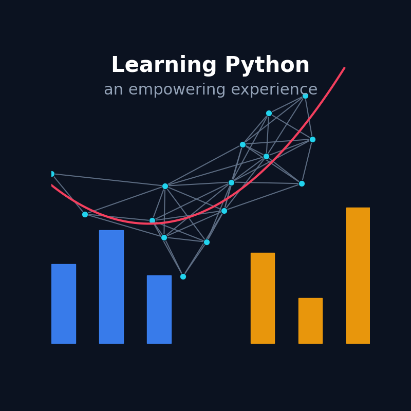

{ width=400px align=left }

!!! note ""

	+ **Upcoming Course Dates**: 30 March &mdash; 27 April, 2026
	+ **Course Format**: this is a "_Project Studio_" style course &mdash; see [description](#course-format)
	+ **Cost**: €450
	+ **Register**: contact us at contact@manabiya.fr
    + **Instructor**: [Dimitar Dimitrov{ align=right width="180" }](https://drdv.net)
	+ **Language**: English

# Introduction to Python (with data analysis applications)

## Overview

This is a project-based, in-person beginner Python course built around collaboration and
real-world practice. You’ll grow by actively working with others while developing a
complete data-processing application from start to finish, relying on practical tools
and workflows commonly used in data science.

We take the “working with other people” part seriously. Your code will live in a
[GitHub](https://github.com/) repository, and you’ll participate in a structured process
of giving and receiving feedback &mdash; similar to a professional development
environment. Throughout the course, you’ll engage in interactive code reviews and
continuous code improvement. Together, we’ll build a common project, creating space to
experiment, make mistakes and learn from them.

## Target audience

People of all ages are welcome (16 and above). We do not assume prior experience with
python, data analysis or math. It would help if you have used some other programming
language before (even if you don't remember the details), but this is not a
prerequisite. However, we assume that you have your own computer that you can bring and
work with[^prerequisites] &mdash; learning to program is not a spectator sport, you have
to jump in and get your hands dirty.

## What will I learn?

You will learn:

+ [X] To use [Git](https://git-scm.com/) (and [GitHub](https://github.com/)) &mdash;
      this would lead to a major change in the way you work and collaborate!
+ [X] To formulate and solve problems using [Python](https://www.python.org/):
    + basic syntax, expressions, and statements
	+ how and when to use: lists, dictionaries, sets, tuples, ...
	+ string processing and regular expressions
	+ control flow: loops, conditionals
    + functions, error handling, working with files
	+ object-oriented programming.
+ [X] To use the python ecosystem as well as to create and publish your own projects.
+ [X] To structure, test and document your code. 
+ [X] To use standard tools in data science
    + [Numpy](https://numpy.org/) and [Pandas](https://pandas.pydata.org/) for data processing and analysis 
	+ [scikit-learn](https://scikit-learn.org/stable/) for building and using machine-learning models &mdash; we will discuss regression models and least-squares. 
+ [X] To visualize your data in a [Jupyter notebook](https://jupyter.org/) using
      [Matplotlib](https://matplotlib.org/) and other libraries.
+ [X] To create a static website on which to describe your results. 

In the end, you will have a solid base to build on (please read this [famous blog
post](https://norvig.com/21-days.html) by Peter Norvig to set expectations).

## Project description

This is a month-long course centered around building a complete data-processing
application from scratch. The core project is split into several parts and focuses on
developing a system that:

+ Accepts as input a simplified version of a double-entry bookkeeping data format (used
  in [ledger cli](https://ledger-cli.org/)). This is a concrete example of a structured,
  non-standard format (something we often need to deal with in practice).
+ Parses the input data using Python (giving you hands-on experience with string
  processing and file handling).
+ Stores the parsed data in carefully designed Python data structures (introducing
  concepts of code organization and data abstraction).
+ Transforms, analyzes, and visualizes the processed data (providing practical exposure
  to real-world data science techniques).
+ Builds simple models and uncovers insights from the data (applying statistical and
  analytical reasoning).
+ Generates reports based on the analysis (learn how to communicate results clearly).
+ Optional challenges are available for those interested in more advanced mathematical
  applications. You’ll also get help to apply what you learn to your own side projects.

## Course format

There are three ways to participate in the course. You can choose the level of
involvement that fits your schedule &mdash; though more participation will naturally
lead to greater benefit.

### :material-github: GitHub Discussions / Issues

+ Ask questions, post issues and share progress
+ Get feedback and participate in technical discussions.

This is how developers collaborate and advance their projects. This option allows you to
participate remotely and asynchronously.

### :material-account-check: Live coding sessions (on-site)

We will hold in-person live coding sessions (in the [office](../contact.md) of Manabiya)
during the following time slots[^attendance]:

+ **Mondays**: 18:00 &mdash; 20:00
+ **Wednesdays**: 14:00 &mdash; 18:00
+ **Saturdays**: 09:30 &mdash; 17:30 (with an hour and a half of lunch break).

These sessions are strongly encouraged, as they provide hands-on guidance, real-time
problem solving, and direct interaction. Regular participation is important and will
significantly enhance your learning experience. However, you are not required to attend
for the entire duration of each session &mdash; you manage your own time. The idea is
simple:

> Come, work on your project, ask questions, and stay as long as you need — especially
until your questions are answered or you feel ready to move forward (active
participation matters more than the number of hours you stay).

### :material-google-chrome: Dedicated online discussions

Whenever needed, we can organize dedicated discussion sessions via e.g., Google Meet to
address pressing questions.

**In short**: you’ll have every opportunity, resource, and bit of guidance you need to
challenge yourself and expand your skills! This is over 50 hours of live-coding,
follow-up on GitHub "Issues" throughout the month, plus the option to have remote
discussions (whenever necessary).

## Can I really follow this course &mdash; I haven't done data science before?

[Don't
Panic](https://en.wikipedia.org/wiki/Phrases_from_The_Hitchhiker%27s_Guide_to_the_Galaxy#Don't_Panic)!
This course is designed for beginners. While some of the material may feel challenging
at times, that’s completely normal and part of the process. By learning Python in the
context of data science, you’ll get a sense of just how useful a language it is (instead
of simply focusing on abstract language syntax &mdash; something you can easily find
online).

[^prerequisites]: You could use Windows, macOS, or Linux (the latter two are
preferable). Before the course starts, you will receive a few suggestions for things to
review in advance (although this is not strictly required, it will help you benefit
fully from the course).

[^attendance]: It is possible to make changes to the time slots (whenever necessary).

